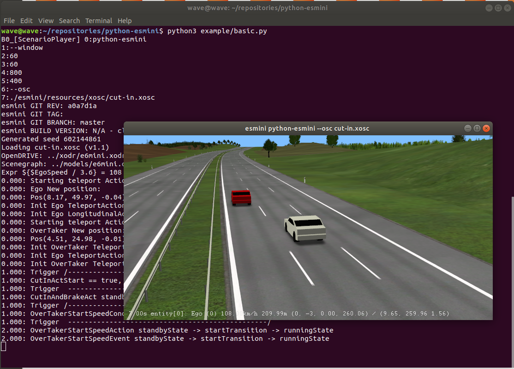

**python-esmini** is a python wrapper for [Environment Simulator Minimalistic (esmini)](https://github.com/esmini/esmini).
### Install the package
```
git clone https://github.com/ebadi/python-esmini.git
cd python-esmini
pip3 install .
```

### Usage
Example python code:
```python
import pyplayerbase
import time

player = pyplayerbase.ScenarioPlayer(["python-esmini", "--window",  "60", "60", "800", "400",  "--osc", "./esmini/resources/xosc/cut-in.xosc"])
while not player.IsQuitRequested():
    player.Frame(1)
    time.sleep(1)
```



To test the python modules, download the esmini resources and run the following scripts:
```shell
python3 example/scenarioplayer.py
python3 example/intermodule.py.py
```

### Documentation
To find the API documentation, follow these [https://ebadi.github.io/python-esmini](https://ebadi.github.io/python-esmini)

To automatically extract the list of methods:
```shell
./test-python-package.sh
python3 example/modlist.py
```


### Development only 
Install [binder](https://github.com/RosettaCommons/binder) and rebuild pybind11 bindings: 
```shell
git clone https://github.com/esmini/esmini.git
cd esmini ; cmake . ; cmake --build . 
cd ..; ./dev-build-bindings.sh
rm LOG_FILE.txt ; pip3 install .  --log LOG_FILE.txt
```

Generating API documentation:
```shell
cd documentation; 
./doc-build.sh
```
 
### Credits
This work is done by [Infotiv AB](https://www.infotiv.se) under [VALU3S](https://valu3s.eu) project. This project has received funding from the [ECSEL](https://www.ecsel.eu) Joint Undertaking (JU) under grant agreement No 876852. The JU receives support from the European Union’s Horizon 2020 research and innovation programme and Austria, Czech Republic, Germany, Ireland, Italy, Portugal, Spain, Sweden, Turkey.

The ECSEL JU and the European Commission are not responsible for the content on this website or any use that may be made of the information it contains.

[python-esmini](https://github.com/ebadi/esmini-pybind11) project is started and is currently maintained by [Hamid Ebadi](https://github.com/ebadi).
